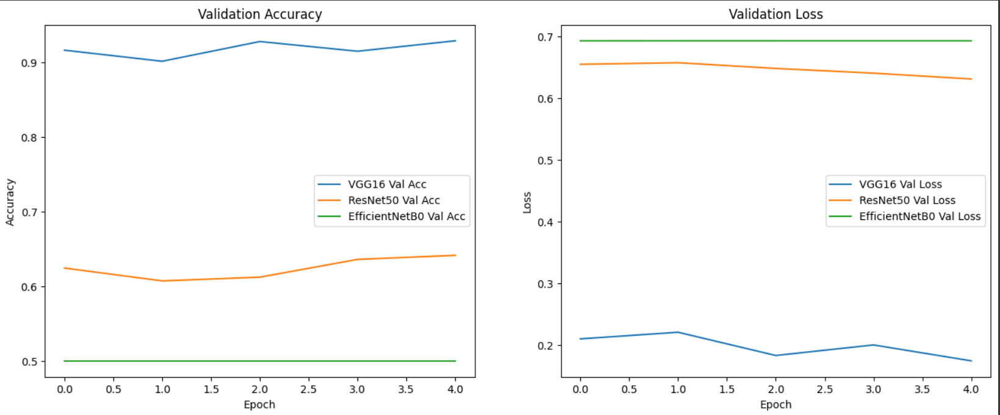
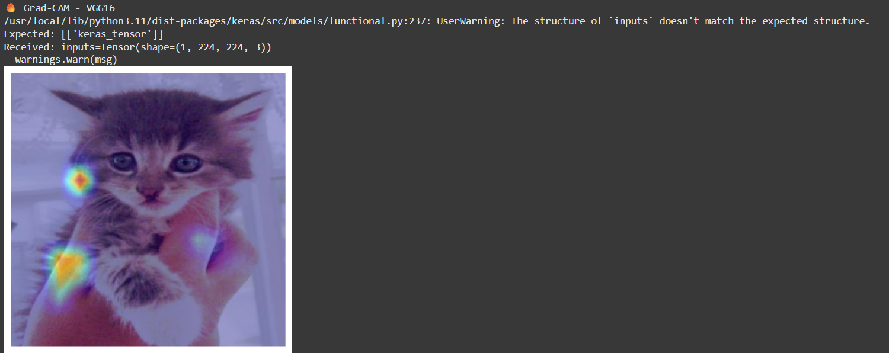
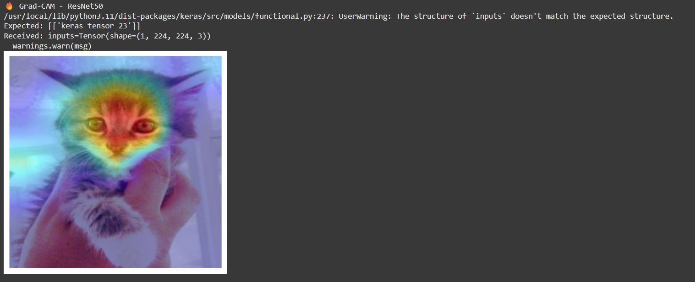
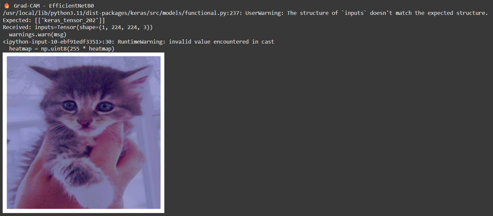

# 🐶🐱 Cats vs Dogs Image Classification with Grad-CAM (Transfer Learning)

This project implements an image classification pipeline using three pre-trained convolutional neural networks—VGG16, ResNet50, and EfficientNetB0—to distinguish between cats and dogs. Additionally, Grad-CAM is used to visualize the model's attention, offering interpretability into CNN predictions.

🔗 [Colab Notebook](https://colab.research.google.com/drive/17PYINngnSAgwxXo80VTIR4hMO42r0Kq7?usp=sharing)  
📄 [Final Report (PDF)](./陳睿棋_4110056032__貓狗圖像分類與_Grad-CAM_可視化（遷移學習）.pdf)

---

You can download the original dataset from:
https://www.kaggle.com/c/dogs-vs-cats/data


## 🎯 Project Objectives

- Use transfer learning to perform binary classification on the [Kaggle Dogs vs. Cats dataset](https://www.kaggle.com/c/dogs-vs-cats).
- Compare performance across different CNN backbones.
- Visualize model decision regions using Grad-CAM.

---

## 🏗️ Model Architecture

Each model uses frozen ImageNet pre-trained weights. The custom classification head is:

BaseModel (VGG16 / ResNet50 / EfficientNetB0)
→ GlobalAveragePooling2D
→ Dense(256, activation='relu')
→ Dropout(0.5)
→ Dense(1, activation='sigmoid')

yaml
複製
編輯

---

## 📂 Dataset Structure

The dataset is organized in a Keras-compatible format:

```
data_split/
├── train/
│ ├── cat/
│ └── dog/
├── test/
│ ├── cat/
│ └── dog/
└── unknown/
```

🔹 Data is loaded using `ImageDataGenerator` with a validation split of 0.2.


Data loading and augmentation are done using `ImageDataGenerator` with a validation split of 0.2.

---

## ⚙️ Hyperparameters

| Parameter        | Value              |
|------------------|--------------------|
| Image size       | 224 × 224          |
| Batch size       | 32                 |
| Optimizer        | Adam               |
| Loss function    | Binary Crossentropy|
| Epochs           | 5                  |

---

## 📈 Validation Accuracy & Loss

Validation performance across 5 epochs is shown below:



| Model          | Validation Accuracy | Validation Loss |
|----------------|---------------------|-----------------|
| **VGG16**      | ⭐ ~92%              | ~0.18           |
| ResNet50       | ~63%                | ~0.64           |
| EfficientNetB0 | ~50% (random guess) | ~0.69           |

📌 **VGG16** performed best under consistent settings.

---

## 🔥 Grad-CAM Visualization Results

Grad-CAM helps visualize which parts of the image the model focuses on during prediction:

### VGG16  
Model attention is dispersed but generally reasonable.



---

### ResNet50  
Strongly focuses on ears, eyes, and faces—most interpretable.



---

### EfficientNetB0  
Failed to generate effective gradients, resulting in poor visualization.



---

> ⚠️ **Note on Warnings:**  
> During Grad-CAM generation, the following warnings were encountered:
>
> - Tensor structure mismatch warnings from Keras Functional API  
> - `RuntimeWarning: invalid value encountered in cast` during heatmap creation  
>
> These do not affect the final visual output in this project but should be addressed in production environments.

---

## ✅ Key Takeaways

- Transfer learning with VGG16 yields strong results on small datasets.
- Grad-CAM offers helpful insight into model interpretability.
- Accuracy alone is not enough—visual clarity helps validate trust.

---

## 🔄 Future Work

- Increase training epochs (e.g., 10+)
- Enable fine-tuning (`model.trainable = True`)
- Explore advanced visualization tools: Score-CAM, SmoothGrad
- Evaluate with precision, recall, F1, and AUC

---

## 📁 Files Included

| File | Description |
|------|-------------|
| `貓狗圖像分類與Grad_CAM可視化(遷移學習).ipynb` | Colab-compatible notebook |
| `陳睿棋_4110056032__貓狗圖像分類與_Grad-CAM_可視化（遷移學習）.pdf` | Final report in Chinese |
| `images/val_acc_loss.png` | Validation accuracy/loss curves |
| `images/gradcam_vgg16.png` | Grad-CAM visualization (VGG16) |
| `images/gradcam_resnet50.png` | Grad-CAM visualization (ResNet50) |
| `images/gradcam_efficientnetb0.png` | Grad-CAM visualization (EfficientNetB0) |

---

## 👨‍💻 Author

**Ricky Chen (陳睿棋)**  
Department of Computer Science  
National Chung Hsing University  
GitHub: [@rickychen0608](https://github.com/rickychen0608) *(if applicable)*
